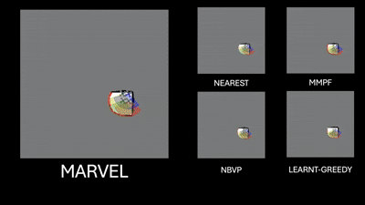

# MARVEL: Multi-Agent Reinforcement Learning for constrained field-of-View multi-robot Exploration in Large-scale environments

This repository hosts the code for [**MARVEL**](https://arxiv.org/abs/2502.20217), accepted for [ICRA 2025](https://2025.ieee-icra.org/).

<div>
   
   
</div>

**Supplementary video link:** [YouTube](https://youtu.be/uwQqkruBvwY)

MARVEL is a neural framework that leverages graph attention networks, together with novel frontiers and orientation features fusion technique, to develop a collaborative, decentralized policy using multi-agent reinforcement learning (MARL) for robots with constrained FoV. 

## Setup instructions

Use conda to setup your environment:

```bash
conda env create -f marvel.yml
conda activate marvel
```

## Evaluation

First, set the appropriate parameters in `test_parameter.py` and run `test_driver.py` to evaluate.

## Training

Set appropriate parameters in `parameter.py` and run `driver.py` to train the model.


## Citation

If you find our work useful, please consider citing our paper:

```bibtex
@article{chiun2025marvel,
  title={MARVEL: Multi-Agent Reinforcement Learning for constrained field-of-View multi-robot Exploration in Large-scale environments},
  author={Chiun, Jimmy and Zhang, Shizhe and Wang, Yizhuo and Cao, Yuhong and Sartoretti, Guillaume},
  journal={arXiv preprint arXiv:2502.20217},
  year={2025}
}

```

Authors:
[Jimmy Chiun](https://www.linkedin.com/in/jimmychiun/),
Shizhe Zhang,
[Yizhuo Wang](https://www.yizhuo-wang.com/),
[Yuhong Cao](https://www.yuhongcao.online/),
[Guillaume Sartoretti](https://cde.nus.edu.sg/me/staff/sartoretti-guillaume-a/)